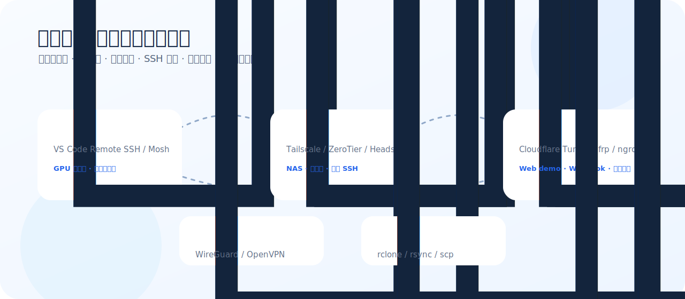

<h1 align="center">学生科研党网络连通性工具箱</h1>

<p align="center">
  <strong>远程服务器 · 自建组网 · 内网穿透 · SSH 排障 · 文件同步 · 合法网络工具</strong>
</p>

> 只收官方工具、自建方案和合法远程访问方案；不收机场购买链接、不收返利、不搬运测速图。

<p align="center">
  
</p>

最后人工核验：**2026-06-27**

如果这个项目帮你少折腾一次 SSH、校园网、远程 GPU 或内网穿透，欢迎 star。后续会继续补充真实排障模板和科研场景配置。

## 快速结论

- **最省心多设备组网**：Tailscale。
- **想自建控制面**：Headscale。
- **虚拟局域网/多人设备互联**：ZeroTier。
- **理解底层和自建点对点 VPN**：WireGuard。
- **临时展示本地 Web demo**：Cloudflare Tunnel 或 ngrok。
- **有 VPS 做内网穿透**：frp。
- **远程 GPU/实验室机器开发**：VS Code Remote SSH + SSH config。
- **弱网终端**：Mosh。
- **同步数据集/实验结果**：rclone。

## 场景速查

| 场景 | 首选 | 备选 | 注意点 |
| --- | --- | --- | --- |
| 远程连实验室服务器 | VS Code Remote SSH | Mosh / Tailscale | 先保证 SSH key 和跳板机配置干净 |
| 多台设备互联 | Tailscale | ZeroTier / Headscale | 免费计划和设备数限制看官方 |
| 本地 Web demo 给别人看 | Cloudflare Tunnel | ngrok / frp | 不要暴露敏感后台 |
| 家里 NAS 外网访问 | Tailscale | ZeroTier / frp | 注意账号安全和 ACL |
| 有 VPS，想自建内网穿透 | frp | WireGuard | 公网服务必须加鉴权 |
| 弱网长时间终端 | Mosh | tmux + SSH | Mosh 需要 UDP |
| 大文件同步 | rclone | rsync / scp | 先 dry-run，避免同步方向反了 |

## 工具总表

| 优先级 | 工具 | 类型 | 状态 | 适合谁 | GitHub | 官方文档 |
| ---: | --- | --- | --- | --- | --- | --- |
| 1 | [Tailscale](docs/tools/tailscale.md) | `mesh-vpn` | 首选 | 多设备互联、远程 SSH、访问家里 NAS/实验室机器、临时组队协作 | [Repo](https://github.com/tailscale/tailscale) | [Docs](https://tailscale.com/kb) |
| 2 | [Headscale](docs/tools/headscale.md) | `self-hosted-control-plane` | 进阶 | 想要自建 Tailscale 控制面、减少对商业控制面的依赖 | [Repo](https://github.com/juanfont/headscale) | [Docs](https://headscale.net/stable/) |
| 3 | [ZeroTier](docs/tools/zerotier.md) | `mesh-vpn` | 推荐 | 需要虚拟局域网、多人设备互联、局域网应用访问 | [Repo](https://github.com/zerotier/ZeroTierOne) | [Docs](https://docs.zerotier.com/) |
| 4 | [WireGuard](docs/tools/wireguard.md) | `vpn-protocol` | 基础设施 | 想理解现代 VPN 基础、搭建轻量点对点隧道的人 | [Repo](https://git.zx2c4.com/wireguard-tools/) | [Docs](https://www.wireguard.com/quickstart/) |
| 5 | [OpenVPN](docs/tools/openvpn.md) | `vpn` | 传统可靠 | 机构网络、传统 VPN 场景、需要兼容老系统的环境 | [Repo](https://github.com/OpenVPN/openvpn) | [Docs](https://openvpn.net/community-resources/) |
| 6 | [Cloudflare Tunnel](docs/tools/cloudflare-tunnel.md) | `tunnel` | 推荐 | 把本地 Web 服务安全暴露到公网、演示 demo、Webhook 回调测试 | [Repo](https://github.com/cloudflare/cloudflared) | [Docs](https://developers.cloudflare.com/cloudflare-one/connections/connect-networks/) |
| 7 | [frp](docs/tools/frp.md) | `reverse-proxy` | 自建常用 | 有 VPS，想把内网服务映射到公网的人 | [Repo](https://github.com/fatedier/frp) | [Docs](https://gofrp.org/) |
| 8 | [ngrok](docs/tools/ngrok.md) | `tunnel` | 临时演示 | 快速把本地服务给别人看、调试 Webhook | [Repo](https://github.com/ngrok/ngrok-api-go) | [Docs](https://ngrok.com/docs/) |
| 9 | [VS Code Remote SSH](docs/tools/vscode-remote-ssh.md) | `remote-dev` | 科研刚需 | 远程开发服务器、GPU 机器、实验室 Linux 环境 | [Repo](https://github.com/microsoft/vscode-remote-release) | [Docs](https://code.visualstudio.com/docs/remote/ssh) |
| 10 | [Mosh](docs/tools/mosh.md) | `terminal` | 弱网神器 | 网络不稳定、移动网络、长时间 SSH 会话 | [Repo](https://github.com/mobile-shell/mosh) | [Docs](https://mosh.org/) |
| 11 | [rclone](docs/tools/rclone.md) | `file-sync` | 文件传输 | 服务器/云盘/本地之间同步数据集、备份实验结果 | [Repo](https://github.com/rclone/rclone) | [Docs](https://rclone.org/docs/) |

## 推荐组合

### 研究生远程服务器开发

```text
VS Code Remote SSH + ~/.ssh/config + tmux + rclone
```

适合 GPU 服务器、实验室工作站、远程跑论文代码。

### 家庭/宿舍/实验室多设备互联

```text
Tailscale 或 ZeroTier
```

适合访问 NAS、台式机、远程开发机，不想折腾公网 IP。

### 自建党方案

```text
Headscale + WireGuard + frp
```

适合有 VPS、愿意维护证书、域名、反向代理和安全策略的人。

## 网络安全底线

- 不要把数据库、Jupyter、Docker API、开发后台裸露到公网。
- 内网穿透服务必须有鉴权，最好再加 IP allowlist 或 Zero Trust。
- SSH 禁用密码登录，使用 key，必要时加 2FA 或堡垒机。
- 云服务器安全组只开必要端口。
- 任何远程访问工具都不是免死金牌，配置错了就是公网裸奔。

## 排障 checklist

- `ping` 不通不代表 TCP 不通，先测具体端口。
- SSH 失败先看 `ssh -vvv`。
- 校园网/公司网可能封 UDP，Mosh、WireGuard、部分 NAT 穿透会受影响。
- DNS 问题和路由问题分开查。
- 先在同一局域网测通，再上公网/隧道。
- 所有自动同步工具先 dry-run。

## 数据维护

结构化数据在 [`data/tools.json`](data/tools.json)。

重新生成：

```bash
python3 scripts/generate.py
```

## 贡献原则

欢迎补充：

- 官方工具和开源项目
- 学生/科研远程访问真实场景
- SSH、隧道、组网、文件同步排障模板
- 安全配置建议

请不要提交：

- 机场购买链接
- 返利链接
- 搬运测速图
- 鼓励绕过学校/公司网络管理的教程
- 未授权转载的测评内容

## Disclaimer

本项目只做合法网络连通性、远程访问和自建工具的信息整理。请遵守所在地法律法规、学校/机构网络管理规定和各项目 license/terms。

## License

MIT.
